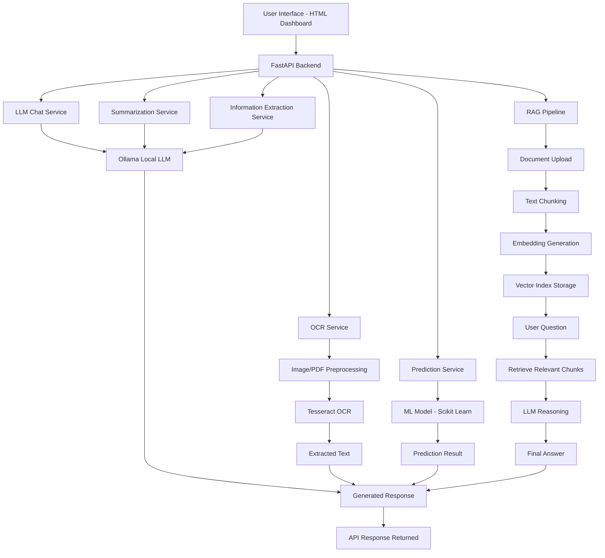

# Offline Document Intelligence Studio

An offline AI-powered API for document processing and local AI inference built using **FastAPI**, **OCR**, **local LLMs**, **Machine Learning**, and **Retrieval-Augmented Generation (RAG)**.

This project demonstrates a complete AI pipeline that includes:

- OCR for extracting text from images and PDFs
- Local LLM chat using Ollama
- Text summarization
- Information extraction
- Machine learning prediction
- Document retrieval
- Retrieval-Augmented Generation (RAG)
- Interactive web UI
- Dockerized deployment

---

# Project Architecture


# Features

## OCR
Extract text from images and PDF documents.

Supports:
- English
- Arabic
- Mixed language documents

Includes preprocessing options:
- Grayscale
- Resize
- Denoise
- Deskew
- Threshold

Libraries used:
- Tesseract
- OpenCV
- PDF2Image
- Pillow

---

## Local LLM Chat

Chat with a **local LLM model** using **Ollama**.

Example models:
- phi3
- llama3.2

Example use cases:
- document questions
- explanations
- general AI tasks

---

## Text Summarization

Summarize long text into concise summaries using the local LLM.

Use cases:
- document summaries
- report summaries
- article compression

---

## Information Extraction

Extract structured data from unstructured text.

Example fields:
- name
- email
- phone
- skills
- organizations

Output format: JSON.

---

## Machine Learning Prediction

A simple ML inference endpoint using a trained model.

Example:
Input numeric features and return predicted class.

Used tools:
- scikit-learn
- joblib

---

## Retrieval

Upload documents and build a searchable retrieval index.

Pipeline:
1. Document upload
2. Chunking
3. Embedding generation
4. Vector storage

---

## Retrieval-Augmented Generation (RAG)

Combine:
- vector retrieval
- local LLM reasoning

Process:

1. Upload documents
2. Index them
3. Ask questions
4. Retrieve relevant chunks
5. Generate answer using LLM

---

## Project Structure

```text
Mohammad_API/
│
├── app/
│   ├── main.py
│   ├── routers/
│   │   ├── ocr.py
│   │   ├── llm.py
│   │   ├── summarize.py
│   │   ├── extract.py
│   │   ├── predict.py
│   │   └── rag.py
│   ├── services/
│   │   ├── ocr_service.py
│   │   ├── llm_service.py
│   │   ├── summary_service.py
│   │   ├── extraction_service.py
│   │   ├── prediction_service.py
│   │   └── rag_service.py
│   ├── ml/
│   │   ├── train_model.py
│   │   └── model.pkl
│   └── data/
│       ├── documents/
│       └── index/
│
├── requirements.txt
├── README.md
```
# Example Workflow

1. Upload document using RAG upload
2. System chunks the document
3. Embeddings are generated
4. Data is stored in vector index
5. User asks question
6. Relevant chunks are retrieved
7. LLM generates final answer

---

# Technologies Used

Backend

- FastAPI
- Python

AI / NLP

- Ollama
- Local LLM models
- Retrieval-Augmented Generation

OCR

- Tesseract
- OpenCV
- PDF2Image
- Pillow

Machine Learning

- scikit-learn
- joblib

Frontend

- HTML
- CSS
- JavaScript

Deployment

- Docker
- Docker Compose

---

# Key Highlights

- Fully offline AI system
- Local LLM inference
- Document intelligence pipeline
- Retrieval-Augmented Generation
- Modular FastAPI architecture
- Dockerized deployment
- Interactive UI


---

# Author

Mohammad Salah 

---

# License

This project is intended for educational and demonstration purposes.

